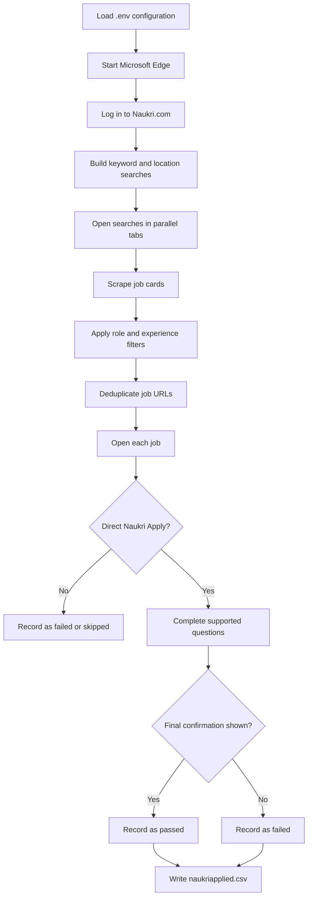

<div align="center">

# Naukri Auto-Apply Bot

### Browser automation for faster, structured job applications on Naukri.com

Automate job discovery, filter relevant listings, handle supported application forms, and track confirmed applications with Microsoft Edge and Selenium.

<br />


<br />

[Quick Start](#quick-start) · [How It Works](#how-it-works) · [Configuration](#configuration) · [Usage](#usage)

</div>

---

## Overview

Naukri Auto-Apply Bot is a Python automation project that uses Selenium to:

- Search Naukri.com by configurable keywords and location
- Open multiple search pages in parallel browser tabs
- Filter and deduplicate job listings
- Use Naukri's direct **Apply** flow
- Handle supported text fields, radio buttons, dropdowns, checkboxes, and multi-step forms
- Reuse saved application answers with fuzzy question matching
- Read supported profile facts from a local resume file
- Record successful and unsuccessful application attempts in CSV format

> The bot only counts an application as successful after Naukri displays a final confirmation.

## Features

| Capability | Description |
| --- | --- |
| Parallel job discovery | Opens keyword and pagination searches in separate Edge tabs |
| Job filtering | Supports role, experience, and exclusion filters |
| Smart deduplication | Removes duplicate job URLs before application attempts |
| Direct applications | Skips external company-site application redirects |
| Questionnaire support | Handles text, textarea, radio, select, checkbox, and multi-step controls |
| Answer reuse | Stores confirmed answers in `application_answers.csv` |
| Resume-assisted answers | Reads supported facts from `resume.txt` |
| Application limits | Stops after the configured `MAX_APPLICATIONS` value |
| Result tracking | Saves passed and failed job URLs to `naukriapplied.csv` |
| Driver management | Uses `webdriver-manager` to download EdgeDriver automatically |

## How It Works



## Project Structure

```text
Naukri-autoapply-bot/
├── Naukri-Edge.py              # Keyword/location search bot
├── Naukri-Recommended.py       # Recommended jobs bot
├── application_answers.csv     # Reusable application answers
├── naukriapplied.csv            # Generated passed/failed results
├── resume.txt                  # Local resume facts used for supported questions
├── requirements.txt             # Python dependencies
├── Naukri autoapply jobs.ipynb # Legacy notebook version
└── README.md
```

## Tech Stack

- **Python**
- **Selenium WebDriver**
- **Microsoft Edge**
- **BeautifulSoup**
- **pandas**
- **python-dotenv**
- **webdriver-manager**
- **html5lib**
- **lxml**

## Quick Start

### Prerequisites

- Python 3.7 or newer
- Microsoft Edge installed
- A valid Naukri.com account
- Internet access for the initial EdgeDriver download

### 1. Clone the project

```bash
git clone https://github.com/Rizwansaifi571/Naukri-AutoApply-Bot.git
cd Naukri-Autoapply-bot
```

### 2. Create a virtual environment

```bash
python -m venv venv
```

Activate it on Windows:

```powershell
venv\Scripts\activate
```

Activate it on macOS or Linux:

```bash
source venv/bin/activate
```

### 3. Install dependencies

```bash
pip install -r requirements.txt
```

### 4. Create a `.env` file

Create a `.env` file in the project root:

```env
NAUKRI_EMAIL=your_email@example.com
NAUKRI_PASSWORD=your_password

FIRSTNAME=YourFirstName
LASTNAME=YourLastName

KEYWORDS=python developer,data analyst,software engineer
LOCATION=bangalore

PAGES_PER_KEYWORD=2
MAX_APPLICATIONS=50

ROLE_FILTERS=intern,full time
EXPERIENCE_FILTERS=fresher,intern,associate
EXCLUDE_FILTERS=

PHONE=+91xxxxxxxxxx
RESUME_FILE=resume.txt
ANSWERS_CSV=application_answers.csv

QUESTION_TIMEOUT=20
QUESTIONNAIRE_TIMEOUT=600
JOB_TIMEOUT=180
REQUIRE_DIRECT_APPLY=true
```

> Never commit `.env`, personal resume data, credentials, or saved application answers.

## Configuration

| Variable | Required | Purpose |
| --- | :---: | --- |
| `NAUKRI_EMAIL` | Yes | Naukri login email |
| `NAUKRI_PASSWORD` | Yes | Naukri login password |
| `FIRSTNAME` | Yes | First name used in forms |
| `LASTNAME` | Yes | Last name used in forms |
| `KEYWORDS` | Yes | Comma-separated job search terms |
| `LOCATION` | No | Location filter; empty searches all locations |
| `PAGES_PER_KEYWORD` | No | Search pages opened per keyword |
| `MAX_APPLICATIONS` | No | Maximum confirmed applications per run |
| `ROLE_FILTERS` | No | Role text filters using OR matching |
| `EXPERIENCE_FILTERS` | No | Experience text filters using OR matching |
| `EXCLUDE_FILTERS` | No | Terms that exclude a job listing |
| `PHONE` | No | Phone number for supported questions |
| `RESUME_FILE` | No | Resume text file path |
| `ANSWERS_CSV` | No | Saved question-answer file path |
| `QUESTION_TIMEOUT` | No | Maximum time for an individual question |
| `QUESTIONNAIRE_TIMEOUT` | No | Maximum questionnaire duration |
| `JOB_TIMEOUT` | No | Maximum processing time per job |
| `REQUIRE_DIRECT_APPLY` | No | Restrict applications to Naukri-hosted flows |

## Usage

### Keyword and Location Search

```bash
python Naukri-Edge.py
```

This flow:

1. Logs in to Naukri.com.
2. Opens configured keyword searches in parallel tabs.
3. Scrapes and filters job listings.
4. Removes duplicate URLs.
5. Visits each job and checks for a direct Naukri Apply button.
6. Handles supported application questions.
7. Saves confirmed results to `naukriapplied.csv`.

### Recommended Jobs

```bash
python Naukri-Recommended.py
```

This flow works with Naukri's recommended jobs area and supports these tabs:

- Applies
- Profile
- Top Candidate
- Preferences
- You might like

The script can reuse known answers automatically. When an unknown question appears, it may wait for you to answer directly in the browser and save that answer for later runs.

## Answer Knowledge Base

Saved answers use this CSV structure:

```csv
question_text,answer,field_type,created_at
Are you willing to relocate?,Yes,radio,2026-09-29T12:00:00
```

Answers may be reused through exact or fuzzy question matching.

The bot can use:

- Saved answers from `application_answers.csv`
- Name, email, phone, and location values from `.env`
- Supported experience and skills facts from `resume.txt`

It does not invent answers for unsupported questions. Missing or invalid answers cause the application attempt to be recorded as failed.

## Output

Results are written to:

```text
naukriapplied.csv
```

The file contains two columns:

```csv
passed,failed
```

- `passed`: applications with a detected final Naukri confirmation
- `failed`: jobs that could not be applied to or were not confirmed

## Safety and Responsible Use

- Use the project only with an account you own or are authorized to use.
- Review every application before submitting it.
- Keep credentials and personal information out of source control.
- Respect Naukri.com's Terms of Service and usage limits.
- The automation may require manual interaction for unknown questions or changing website flows.
- Website redesigns can change selectors and break browser automation.

## Known Limitations

- Naukri.com page structure and selectors may change.
- CAPTCHA, two-factor authentication, and anti-bot challenges may require manual handling.
- Only supported question types and known profile facts can be completed automatically.
- External company-site applications are skipped when direct applications are required.
- The recommended-jobs script uses a fixed batch size of up to five selected jobs.

## Future Scope

Potential improvements include:

- More resilient selectors for future Naukri UI changes
- Better application history and reporting
- Expanded support for additional questionnaire controls
- Configurable headless execution
- Automated test coverage for parsing and filtering logic
- Optional screenshots or run summaries for each application attempt

## Disclaimer

This project is provided for educational purposes. Use it responsibly and in accordance with Naukri.com's Terms of Service.
